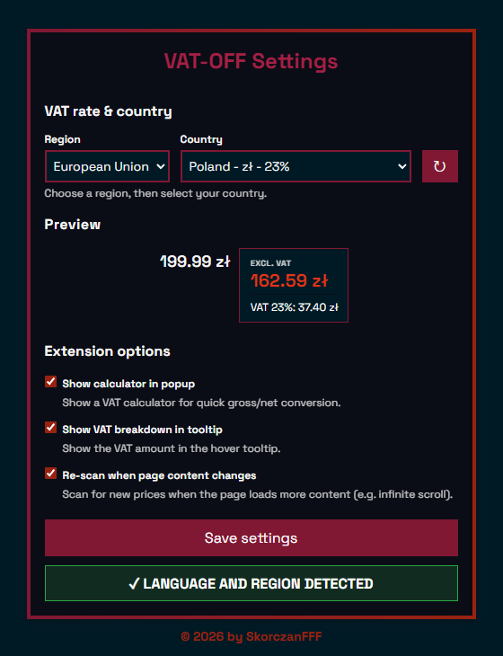

# VAT-OFF Chrome Extension

A powerful Chrome extension that automatically detects prices on web pages and displays prices excluding VAT when you hover over them. Perfect for businesses, accountants, and anyone who needs to quickly see net prices. Supports 100+ countries across 7 continents with automatic region detection, custom VAT rates, and real-time price detection.

## 📸 Screenshots

### Extension Popup
The compact popup provides quick access to enable/disable the extension, change VAT settings, and use the built-in calculator.

<div align="center">
  
</div>

### Settings Page
The comprehensive settings page allows you to configure all extension options, select countries, set custom VAT rates, and preview tooltip appearance.

<div align="center">
  
</div>

## 🌟 Features

### Core Functionality

#### **Automatic Price Detection & Hover Tooltips**
- **Intelligent Price Scanning**: Automatically scans web pages for price numbers in various formats (commas, dots, spaces, currency symbols)
- **Hover Tooltip Display**: Shows price excluding VAT when hovering over detected prices on any website
- **Smart Price Parsing**: Handles multiple number formats including:
  - European format: `599,99 zł`, `768.00 €`
  - US format: `$1,234.56`
  - UK format: `£99.99`
  - Plain numbers: `1234.56`, `12 000`
- **False Positive Filtering**: Intelligently filters out phone numbers, dates, version numbers, and other non-price numbers

#### **Region Detection via System Language**
- **Automatic Detection**: Automatically detects your country and region based on your browser's system language (`navigator.language`)
- **Language Mapping**: Maps browser language codes to appropriate countries (e.g., `pl-PL` → Poland, `de-DE` → Germany)
- **Manual Override**: "Detect Language" button in settings to re-detect or manually select your region/country
- **Fallback Support**: Falls back to English (GB) if your language isn't mapped

#### **Continents and Countries with Currencies and VAT Rates**
- **7 Regions Supported**: 
  - **European Union** (27 countries): Austria, Belgium, Bulgaria, Croatia, Cyprus, Czech Republic, Denmark, Estonia, Finland, France, Germany, Greece, Hungary, Ireland, Italy, Latvia, Lithuania, Luxembourg, Malta, Netherlands, Poland, Portugal, Romania, Slovakia, Slovenia, Spain, Sweden
  - **Other Europe** (16 countries): Albania, Andorra, Belarus, Bosnia & Herzegovina, Iceland, Liechtenstein, Moldova, Monaco, Montenegro, North Macedonia, Norway, Russia, Serbia, Switzerland, Turkey, Ukraine, United Kingdom
  - **Asia** (19 countries): Bangladesh, Bhutan, Cambodia, China, India, Indonesia, Japan, Kazakhstan, Laos, Nepal, Pakistan, Philippines, Singapore, South Korea, Sri Lanka, Taiwan, Tajikistan, Thailand, Uzbekistan, Vietnam
  - **Americas** (24 countries): Argentina, Barbados, Belize, Bolivia, Brazil, Canada, Chile, Colombia, Costa Rica, Dominican Republic, Ecuador, El Salvador, Guatemala, Guyana, Haiti, Honduras, Jamaica, Mexico, Nicaragua, Panama, Paraguay, Peru, Trinidad & Tobago, Uruguay, Venezuela
  - **Africa** (21 countries): Algeria, Angola, Botswana, Cameroon, Egypt, Ethiopia, Ghana, Kenya, Madagascar, Mauritius, Morocco, Mozambique, Namibia, Nigeria, Rwanda, Senegal, South Africa, Tanzania, Tunisia, Uganda, Zambia, Zimbabwe
  - **Middle East** (7 countries): Bahrain, Israel, Jordan, Lebanon, Oman, Saudi Arabia, United Arab Emirates
  - **Oceania** (7 countries): Australia, Fiji, New Zealand, Papua New Guinea, Samoa, Tonga, Vanuatu
- **Pre-configured VAT Rates**: Each country includes its standard VAT/GST rate
- **Currency Symbols**: Each country includes its native currency symbol (€, £, $, zł, kr, etc.)

#### **Custom VAT Rate and Currency**
- **Custom Rate Option**: Select "Custom rate" from the country dropdown to set your own VAT percentage
- **Flexible VAT Rate**: Enter any VAT rate from 1% to 100%
- **Custom Currency Symbol**: Set your own currency symbol (up to 4 characters)
- **Validation**: Real-time validation ensures VAT rates are valid numbers within acceptable range
- **Persistent Settings**: Custom rates and currencies are saved and synced across your devices

#### **Dynamic VAT Calculations in Popup on Websites While Hovering Prices**
- **Real-time Calculation**: Calculates VAT-excluded prices instantly as you hover over detected prices
- **Currency Detection**: Automatically detects currency from the price text or uses your selected country's currency
- **Accurate Formulas**: Uses precise VAT calculation: `Price Without VAT = Price With VAT / (1 + VAT Rate / 100)`
- **Visual Feedback**: Tooltips appear smoothly with proper positioning to stay within viewport

#### **Enableable VAT Calculator in Popup with NET/GROSS Calculations**
- **Optional Calculator**: Enable/disable the calculator section in the popup via settings
- **NET/GROSS Toggle**: Switch between two calculation modes:
  - **Calculate from Gross** (NET mode): Enter gross price → shows net price + VAT amount
  - **Calculate from Net** (GROSS mode): Enter net price → shows gross price + VAT amount
- **Dynamic Updates**: Calculator automatically uses your selected VAT rate and currency
- **Real-time Calculation**: Results update instantly as you type
- **Collapsible Section**: Calculator section can be collapsed/expanded (state is saved)

#### **Tooltip Settings (VAT Breakdown)**
- **VAT Breakdown Toggle**: Option to show/hide VAT amount and percentage in hover tooltips
- **Detailed Information**: When enabled, tooltip shows:
  - Price excluding VAT
  - VAT percentage
  - VAT amount in currency
- **Customizable Display**: Toggle this setting in the options page

#### **Enableable Automatic Rescanning When Content Changes**
- **Dynamic Content Monitoring**: Optional feature to watch for new content added to pages
- **MutationObserver**: Uses browser's MutationObserver API to detect DOM changes
- **Automatic Rescanning**: When enabled, automatically scans for new prices when:
  - Content is loaded via JavaScript (e.g., infinite scroll)
  - Prices are added dynamically (e.g., shopping cart updates)
  - Page content changes after initial load
- **Performance Optimized**: Debounced rescanning (1 second delay) prevents excessive processing
- **Toggle Option**: Can be enabled/disabled in settings

### Additional Features

- **Collapsible Sections**: Popup sections can be collapsed/expanded with state persistence
- **Live Preview**: Options page shows a live preview of how tooltips will appear
- **Settings Sync**: All settings sync across devices using Chrome sync storage
- **Error Handling**: Comprehensive error logging and user-friendly error messages
- **Performance Optimized**: Limits processing to prevent DOM bloat (max 500 price elements)
- **Accessibility**: Keyboard navigation support, ARIA labels, semantic HTML
- **Modern UI**: Clean, modern interface with Space Grotesk font and gradient accents

## 📦 Installation

### From Chrome Web Store

1. Visit the Chrome Web Store listing for VAT-OFF
2. Click "Add to Chrome"
3. Confirm installation
4. The extension icon will appear in your browser toolbar
5. Click the icon to open the popup and start using the extension (see [screenshots](#-screenshots) above)

### From Source (Developer Mode)

1. **Download or clone this repository**
   ```bash
   git clone <repository-url>
   cd VAT-OFF
   ```

2. **Open Chrome Extensions Page**
   - Navigate to `chrome://extensions/`
   - Or: Menu → More Tools → Extensions

3. **Enable Developer Mode**
   - Toggle "Developer mode" in the top right corner

4. **Load the Extension**
   - Click "Load unpacked"
   - Select the `VAT-OFF` folder (the one containing `manifest.json`)

5. **Verify Installation**
   - The extension should appear in your extensions list
   - You should see the VAT-OFF icon in your browser toolbar

## 🚀 Quick Start

### First-Time Setup

1. **Click the Extension Icon**
   - Click the VAT-OFF icon in your browser toolbar to open the popup
   - <div align="center"></div>

2. **Select Your Country** (or use auto-detection)
   - The extension automatically detects your region based on system language
   - Or manually select a region from the dropdown (EU, Asia, Americas, etc.)
   - Then select your country from the country dropdown
   - The extension will automatically use that country's VAT rate and currency

3. **Enable the Extension**
   - Click "Enable" button in the popup
   - The status indicator will show "ENABLED"

4. **Browse Websites**
   - Visit any website with prices
   - Hover over detected price numbers
   - See the price excluding VAT in a tooltip

### Using Custom VAT Rate

1. **Open Popup or Options**
   - Click the extension icon (popup) or right-click → Options

2. **Select "Custom Rate"**
   - Choose "Custom rate" from the country dropdown

3. **Enter Details**
   - Enter VAT rate (1-100%)
   - Enter currency symbol (max 4 characters, e.g., "€", "$", "zł")
   - Click "Save settings" (popup) or "Save settings" button (options page)

### Using the VAT Calculator

1. **Enable Calculator** (if not already enabled)
   - Open Options page (right-click extension icon → Options)
   - Check "Show calculator in popup"
   - Click "Save settings"

2. **Open Popup**
   - Click the extension icon
   - The calculator section will be visible

3. **Choose Calculation Mode**
   - **Calculate from gross** (checked): Enter gross price → see net price
   - **Calculate from gross** (unchecked): Enter net price → see gross price

4. **Enter Amount and VAT Rate**
   - Enter the amount in the "Amount" field
   - VAT rate is automatically set from your selected country
   - You can manually adjust the VAT rate if needed

5. **View Results**
   - Results update in real-time as you type
   - Shows the calculated price and VAT amount

## ⚙️ Settings & Options

Access the full options page by right-clicking the extension icon and selecting "Options":

<div align="center">
  
</div>

### VAT Rate & Country
- **Region Selection**: Choose from 7 regions (EU, Other Europe, Asia, Americas, Africa, Middle East, Oceania)
- **Country Selection**: Select your country to use its pre-configured VAT rate and currency
- **Language Detection**: "Detect Language" button to re-detect your system language and region
- **Custom Rate**: Set custom VAT rate (1-100%) and currency symbol

### Extension Options
- **Show calculator in popup**: Enable/disable the VAT calculator section in the popup
- **Show VAT breakdown in tooltip**: Toggle VAT amount display in hover tooltips
- **Re-scan when page content changes**: Enable automatic rescanning for dynamically loaded content

### Preview
- Live preview shows how tooltips will appear with your current settings
- Updates in real-time as you change settings

## 💡 Usage Tips

### Best Practices
- **Enable Dynamic Rescanning**: For sites with infinite scroll or dynamic content, enable "Re-scan when page content changes"
- **Use Custom Rate**: If your country's VAT rate differs from the standard rate, use custom rate
- **Tooltip Breakdown**: Enable VAT breakdown to see both net price and VAT amount
- **Calculator**: Use the calculator for quick conversions without hovering over prices

### Supported Price Formats
The extension recognizes various price formats:
- Currency symbols: `€`, `$`, `£`, `zł`, `kr`, `Kč`, `lei`, `лв`, `₴`, `Br`, `Ft`, and many more
- Number separators: Commas, dots, spaces
- Decimal places: Handles both 2-decimal and whole number prices

### Troubleshooting
- **Prices Not Detected**: Ensure extension is enabled and refresh the page
- **Wrong Currency**: Check your country selection or set custom currency
- **Tooltip Not Showing**: Hover directly over the price number, not surrounding text
- **Dynamic Content**: Enable "Re-scan when page content changes" for JavaScript-loaded prices

## 🔧 Technical Details

### Architecture
- **Manifest Version**: 3 (latest Chrome extension standard)
- **Permissions**:
  - `storage`: Saving and syncing user settings (sync + local)
  - `activeTab`: Temporary access to the current tab when the user clicks the extension icon
  - `scripting`: Injecting the content script and CSS into the active tab on demand
- **Injection model**: No declarative content scripts. When the user opens the popup (clicks the icon), the extension injects the price-detection script and styles into the **current tab only** via `chrome.scripting.executeScript` and `chrome.scripting.insertCSS`. VAT tooltips then run only in that tab; other tabs get the script only if the user opens the popup while that tab is active.
- **Storage**: Uses Chrome's sync storage for cross-device settings

### File Structure
```
VAT-OFF/
├── manifest.json              # Extension configuration
├── popup.html                 # Extension popup UI
├── options.html               # Settings page
├── scripts/
│   ├── config.js              # VAT rates and country data (100+ countries)
│   ├── content.js             # Main content script (price detection & tooltips)
│   ├── error-handler.js       # Error logging utility
│   ├── options.js             # Options page functionality
│   ├── popup.js               # Popup functionality
│   └── settings.js             # Settings management utility
├── styles/
│   ├── variables.css          # CSS variables and form controls
│   ├── components.css         # Shared component styles
│   ├── content.css            # Content script styles (tooltips)
│   ├── fonts.css              # Font face declarations for bundled fonts
│   ├── options.css            # Options page styles
│   └── popup.css              # Popup styles
├── fonts/                     # Bundled font files (Space Grotesk)
│   └── static/                # Font weight variants (TTF format)
└── icons/
    ├── icon16.png             # Extension icon (16x16)
    ├── icon48.png             # Extension icon (48x48)
    ├── icon128.png            # Extension icon (128x128)
    └── *.svg                  # UI icons (calculator, settings, gauge)
```

### Key Technologies
- **Vanilla JavaScript**: No frameworks, pure ES6+
- **CSS Variables**: Theming system with consistent color palette
- **Chrome Storage API**: Persistent settings across sessions and devices
- **MutationObserver**: Real-time DOM change detection for dynamic content
- **TreeWalker API**: Efficient DOM traversal for price detection
- **Range API**: Precise text node manipulation for price wrapping

### Performance Optimizations
- **Element Limits**: Maximum 500 price elements to prevent DOM bloat
- **Debouncing**: 1-second debounce on rescanning to prevent excessive processing
- **Visibility Checks**: Fast visibility checks using `offsetParent` instead of expensive `getComputedStyle`
- **Node Limits**: Stops scanning after 5000 nodes to prevent performance issues
- **Cleanup**: Automatic cleanup of removed DOM elements

## 🔒 Privacy & Security

- **No Data Collection**: No data is collected or sent to external servers
- **Local Processing**: All calculations are performed locally in your browser
- **Local Storage**: Settings are stored locally using Chrome's sync storage (encrypted by Chrome)
- **No Tracking**: No analytics, no telemetry, no tracking of any kind
- **Open Source**: Code is open for inspection
- **No External Requests**: All fonts (Space Grotesk) are bundled locally with the extension - no external requests

## 🌍 Supported Countries

### European Union (27 countries)
Austria (20% €), Belgium (21% €), Bulgaria (20% лв), Croatia (25% €), Cyprus (19% €), Czech Republic (21% Kč), Denmark (25% kr), Estonia (24% €), Finland (25.5% €), France (20% €), Germany (19% €), Greece (24% €), Hungary (27% Ft), Ireland (23% €), Italy (22% €), Latvia (21% €), Lithuania (21% €), Luxembourg (17% €), Malta (18% €), Netherlands (21% €), Poland (23% zł), Portugal (23% €), Romania (19% lei), Slovakia (20% €), Slovenia (22% €), Spain (21% €), Sweden (25% kr)

### Other Europe (16 countries)
Albania (20% ALL), Andorra (4.5% €), Belarus (20% Br), Bosnia & Herzegovina (17% BAM), Iceland (24% kr), Liechtenstein (8.1% CHF), Moldova (20% MDL), Monaco (20% €), Montenegro (21% €), North Macedonia (18% MKD), Norway (25% kr), Russia (22% ₽), Serbia (20% RSD), Switzerland (8.1% CHF), Turkey (20% ₺), Ukraine (20% ₴), United Kingdom (20% £)

### Asia (19 countries)
Bangladesh (15% ৳), Bhutan (7% Nu.), Cambodia (10% ៛), China (13% ¥), India (18% ₹), Indonesia (11% Rp), Japan (10% ¥), Kazakhstan (12% ₸), Laos (10% ₭), Nepal (13% रू), Pakistan (18% ₨), Philippines (12% ₱), Singapore (9% S$), South Korea (10% ₩), Sri Lanka (18% ₨), Taiwan (5% NT$), Tajikistan (14% сом), Thailand (7% ฿), Uzbekistan (12% so'm), Vietnam (8% ₫)

### Americas (24 countries)
Argentina (21% $), Barbados (17.5% $), Belize (12.5% $), Bolivia (13% Bs.), Brazil (17.5% R$), Canada (5% $), Chile (19% $), Colombia (19% $), Costa Rica (13% ₡), Dominican Republic (18% $), Ecuador (12% $), El Salvador (13% $), Guatemala (12% Q), Guyana (14% $), Haiti (10% G), Honduras (15% L), Jamaica (15% $), Mexico (16% $), Nicaragua (15% C$), Panama (7% B/.), Paraguay (10% ₲), Peru (18% S/), Trinidad & Tobago (12.5% $), Uruguay (22% $), Venezuela (16% Bs.)

### Africa (21 countries)
Algeria (19% د.ج), Angola (14% Kz), Botswana (14% P), Cameroon (19.25% FCFA), Egypt (14% £), Ethiopia (15% Br), Ghana (12.5% ₵), Kenya (16% KSh), Madagascar (20% Ar), Mauritius (15% ₨), Morocco (20% د.م.), Mozambique (17% MT), Namibia (15% $), Nigeria (7.5% ₦), Rwanda (18% FRw), Senegal (18% FCFA), South Africa (15% R), Tanzania (18% TSh), Tunisia (19% د.ت), Uganda (18% USh), Zambia (16% ZK), Zimbabwe (15% $)

### Middle East (7 countries)
Bahrain (10% .د.ب), Israel (17% ₪), Jordan (16% د.ا), Lebanon (11% ل.ل), Oman (5% ر.ع.), Saudi Arabia (15% ر.س), United Arab Emirates (5% د.إ)

### Oceania (7 countries)
Australia (10% $), Fiji (9% $), New Zealand (15% $), Papua New Guinea (10% K), Samoa (15% T), Tonga (15% T$), Vanuatu (15% Vt)

## 📝 Version History

### v1.0.0 (Current)
- Initial release
- 100+ countries across 7 regions
- Automatic region detection via system language
- Region/country selector with two-level navigation
- Custom VAT rates with currency support
- Dynamic content monitoring with MutationObserver
- VAT breakdown toggle in tooltips
- Enableable VAT calculator with NET/GROSS modes
- Collapsible popup sections with state persistence
- Live preview in options page
- Comprehensive error handling
- Performance optimizations
- Settings sync across devices

## 🤝 Contributing

Contributions are welcome! Areas for improvement:
- Additional countries/VAT rates
- Price format detection improvements
- Performance optimizations
- UI/UX enhancements
- Bug fixes
- Translation support

Please ensure code follows existing style and includes appropriate error handling.

## 📄 License

This project is open source. Feel free to modify and distribute according to your needs.

## 🆘 Support

For issues, questions, or contributions, please use the repository's issue tracker.

---

**Note**: This extension is designed for Chrome Web Store distribution. All features work seamlessly across Chrome and Chromium-based browsers (Edge, Brave, Opera, etc.) that support Manifest V3.
